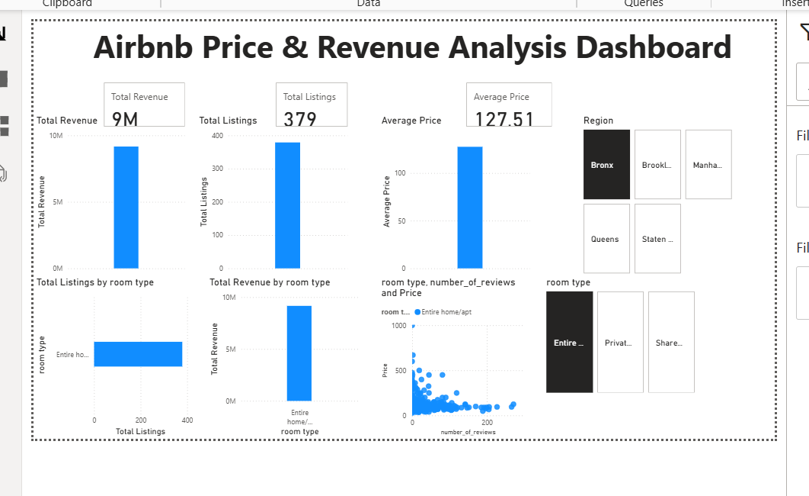

# 🏠 Airbnb Analysis Dashboard (Excel & Power BI)
## 📊 Project Overview
This project analyzes Airbnb data to understand pricing trends, revenue patterns, and location-based insights. An interactive dashboard was built using Power BI and Excel to explore key factors affecting listings.

## 🛠 Tools Used
- Microsoft Excel  
- Power BI  
- Data Cleaning  
- Data Visualization  

## 🔍 Steps Performed
- Cleaned and prepared Airbnb dataset  
- Analyzed pricing and revenue patterns  
- Built interactive dashboard using Power BI  
- Used slicers to enable dynamic filtering and insights  

## 📈 Key Insights
- Listings in prime locations have higher prices and revenue  
- Revenue varies significantly across different neighborhoods  
- Seasonal trends impact pricing and booking patterns  
- Certain property types generate more consistent revenue  

## 📂 Files in this Repository
- Project files (Excel / Power BI) → Main analysis  
- Dataset (CSV) → Data used  
- Screenshot png → Dashboard previews  

## 📸 Dashboard Preview

## 📝 Note
Dataset has been optimized for performance and file size. The dashboard includes slicers for interactive analysis.
